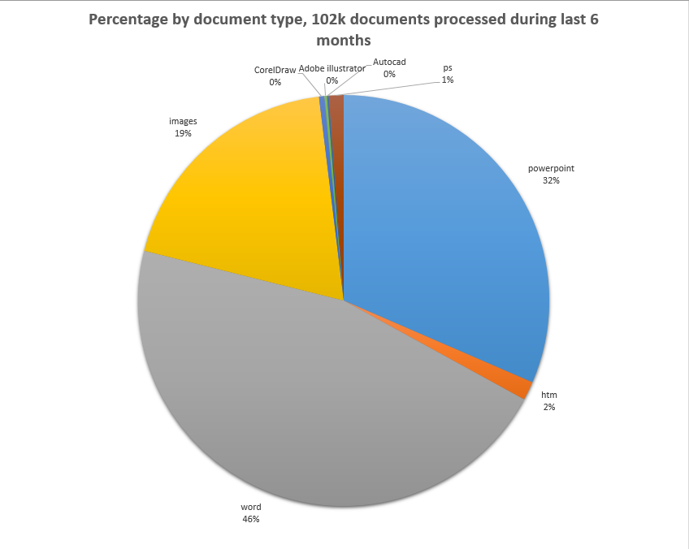
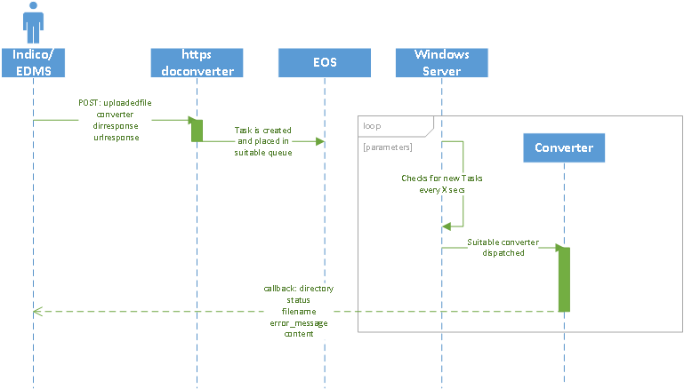

# CERN document conversion service

[](https://travis-ci.org/CERNCDAIC/doconverter)

The conversion service intends to automatically convert a number of application formats, input ones,
to a different format, output ones, usually PDF or PDF/A though evolution of the service is always possible
and more variety on terms of input and output file format could be possible. It's thought to do so asynchronously using
a REST API.



## Workflow and syntax

The communication to the converter is done via a REST API with no authentication. The sequence is basically as:




While a new document is uploaded to the doconverter server, several parameters need to be specified:

- **uploadedfile**: Use multipart/form-data to upload your file.
- **converter**: format we would like to convert to, e.g. pdf, pdfa, ps, thumb*...
- **dirresponse**: where you expect to store the converted file, it will be use when sending back your new converted document
- **urlresponse**: callback that we will use to contact you e.g. https://mydomain.ch/api/receivefiles
- **options**: special options depending on type of document conversion


| Input File | Conversion output | Options | Expected result | Comments |
| -- | -- | -- | -- | -- |
| Office 2016, Autocad(cdx), OpenOffice, Coreldraw(cdr),rtf,htm,bmp,jpg,tif | converter=[pdf,dfa,ps] | N/A | pdf file | N/A |
| Special case for Word documents(e.g. doc,docx) | converter=[pdf,pdfa] | hidedocumentrevisions=[false,true] |pdf file | You may want to have comments visible on your pdf, by default they are not|
| PDF file | converter=toimg | typeofimg=[jpeg,bmp,tiff,png]:imgresh=200:imgresv=200* | zip or tif file | Depending on the format of file chosen a tif file or zip file containing all the numbered pages of the document will be sent back. E.g. original file mypresentation.pdf -> zip: mypresentation.zip or tif: mypresentation.tif |
| PDF file | converter=thumb | imgresh=200:imgresv=200:imgheight=300:imgwidth=300** | png file| if original file was called mydocument.pdf -> mydocument1.png |
| PLT file | converter=hpgl | color=[true,false] | pdf file | N/A |
| tif,png,jgp | converter=tesocr | N/A | pdf searchable file | It uses tesseract-ocr as engine that just support image files |
| pdf, tif | converter=modiocr | language=[english,french] | pdf searchable file | N/A |

***imgresh,imgresv**: should be one of _'72x72','100x100','150x150','200x200','300x300','400x400','600x600','1200x1200'_
****imgresh,imgresv,imgheight,imgwidth**:should be one of _'72x72','100x100','150x150','200x200','300x300','400x400','600x600','1200x1200'_ and _imgheight_imgwidth_ should be an integer in pixels e.g.: thumb_200_200_150_150

As result of a submission, you should get a result of your submitted job, either a success in that case you get a file with the expected format or a error in that case you get an error message:

- **directory**: where you would like to place your document
- **status**: 1 if success, different number otherwise
- **filename**: name of the file provided in the content
- **error_message**: in case of an error, an explanation why that happened
- **content**: expected file coded in a multipart/form-data section

An example can be found within doconverter project functional test module, see [Github](https://github.com/CERNCDAIC/doconverter/blob/master/doconverter/test/www_upload_test.py)

## Architecture

The two main components of the framework are a web fronted and worker nodes. Worker nodes are running on Windows as
most of the functionality of the document conversion service deals with office applications. Web server and worker nodes
don't run in the same server and communication about conversion jobs is done using a common file system.
[EOS](http://eos.web.cern.ch/) is a CERN developed file system that can be accessed from Linux like and Windows
operating systems.

Both components have been developed using Python3.
A PostgreSQL database is used to keep accounting of jobs requested and results.

##
## Setup

The application expects this structure on a windows server:
```
c:\doconverter
              \logs
              \config\
                      doconverter.ini
                      logging.conf
              \files
              \cert
              \doconverter
```

A sample of doconverter.ini and logging.conf can be found in the project.

Possible setup on a Windows machine:

```
# Activate appropiate environment
workon doconverter
cd c:\doconverter
git clone https://github.com/CERNCDAIC/doconverter.git
cd doconverter
pip install -r requirement.txt
# This is required to run COM. Cant be added as it will fail image build on Openshift (Linux)
pip install pypiwin32

# Database setup, PostgreSQL user and schema should be available
python
from doconverter.models.extensions import db
from doconverter.models.Taskdb import Taskdb
from doconverter.models.Result_Conversion import Result_Conversion
db.drop_all()
db.create_all()

# Run converter
(doconverter) C:\doconverter\doconverter\doconverter\engines>python converter_daemon.py --help
usage: converter_daemon.py [-h] [--n NPROCESSES] [--t TIMETOSLEEP]
                           [--send SENDTASKID] [--s] [--r] [--m] [--a ARCHIVE]
                           [--c COMPUTER]
Processing of tasks
optional arguments:
  -h, --help         show this help message and exit
  --n NPROCESSES     number of documents to treat in parallel
  --t TIMETOSLEEP    time to wait for new tasks in secs
  --send SENDTASKID  Get the task information and try to send it, it is
                     supposed it was properly converted
  --s                creates a flag in the local file system for clean stop
  --r                deletes flag for clean shutdown in the local file system,
                     if present
  --m                Performs basic monitoring checks
  --a ARCHIVE        items older than this number of days will be moved to
                     archive
  --c COMPUTER       queue to work tasks from. Usually same as the server were
                     the program runs.

# Run a worker with two processes
python .\engines\converter_daemon.py --n 2

# Run a test web server on a public IP
(doconverter) C:\doconverter\doconverter\doconverter\api>python handlers.py
 * Restarting with stat
 * Debugger is active!
 * Debugger PIN: 294-034-801
 * Running on http://0.0.0.0:8080/ (Press CTRL+C to quit)

```

## Software

The project relies in several packages for conversion:
  - [Neevia DocPro converter](https://neevia.com/) a license is required, though a test software is available. Most
  office like conversions are done using this software. It requires also that those applications be installed on the
  server e.g. Microsoft Office, Open Office, Autocad, etc..
  - [Tesseract-OCR](https://github.com/tesseract-ocr/tesseract) it converts image files to a searchable PDF.
  - [SharepointDesigner 2007](https://www.microsoft.com/en-us/download/details.aspx?displaylang=en&id=21581) it converts
   images and PDF files to a searchable PDF. It uses Neevia COM.
  - [HPGL-Viewer](http://service-hpglview.web.cern.ch/service-hpglview/) it converts PLT files to PDF.

